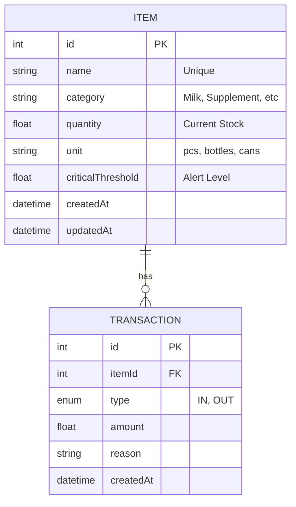

# Laporan Akhir: School Nutrition Vault (Student Side Inventory)

## 1. Pendahuluan
Sistem ini dirancang untuk memantau stok nutrisi (susu dan suplemen) di UKS sekolah guna mendukung program Makan Bergizi Gratis (MBG). Fitur utama meliputi pengelolaan inventaris, pencatatan transaksi barang masuk/keluar, dan sistem peringatan stok kritis.

## 2. Entity Relationship Diagram (ERD)

Berikut adalah struktur basis data yang digunakan:

**Penjelasan Relasi:**
- **Item (1) ke Transaction (N):** Satu item barang dapat memiliki banyak riwayat transaksi (masuk atau keluar).
- **Stok Otomatis:** Setiap kali transaksi dibuat, kolom `quantity` pada tabel `Item` akan diperbarui secara otomatis melalui Prisma Transaction.

## 3. Hasil Pengujian Endpoint (Postman)

*Silakan tempelkan screenshot Postman Anda di bawah setiap poin berikut:*

### A. Create New Item (POST `/api/inventory`)
*Digunakan untuk menambahkan stok baru ke sistem.*
> **Screenshot Placeholder:**
> 

### B. Get Inventory Summary (GET `/api/inventory/summary`)
*Menampilkan dashboard ringkas: total barang, jumlah peringatan stok rendah, dan transaksi terakhir.*
> **Screenshot Placeholder:**
> 

### C. Add Stock Transaction (POST `/api/inventory/:id/transaction`)
*Mencatat barang keluar (misal: susu dibagikan ke siswa) atau barang masuk.*
> **Screenshot Placeholder:**
> 

### D. Low Stock Alerts (GET `/api/inventory/alerts`)
*Menampilkan daftar barang yang sudah mencapai batas kritis agar segera dipesan ulang.*
> **Screenshot Placeholder:**
> 

## 4. Kesimpulan
Sistem berhasil diimplementasikan dengan Clean Code, validasi data menggunakan Zod, dan dokumentasi API yang lengkap via Swagger. Kontainerisasi dengan Docker memastikan sistem dapat dijalankan di lingkungan mana pun dengan konsisten.
